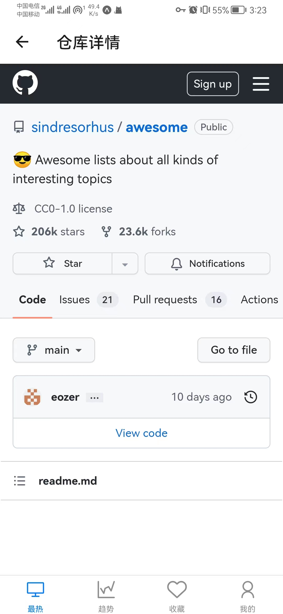
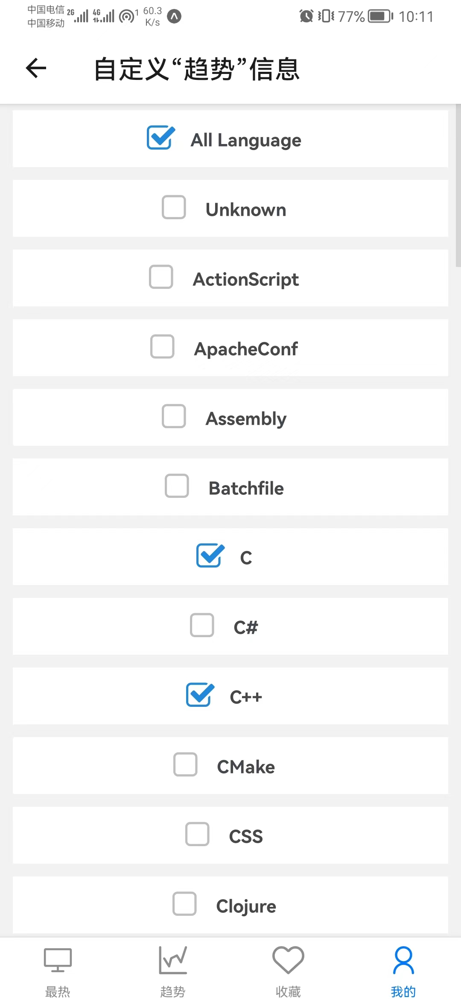

## Github-Popular-with-RN

用作学习

使用 `react native` 开发

### 使用的库

- React Native Elements（yarn add @rneui/themed @rneui/base）
- react-navigation（[相关链接](https://reactnative.dev/docs/navigation#react-navigation)）
- Async Storage（[相关链接](https://react-native-async-storage.github.io/async-storage/)）
- react-native-modal-dropdown（[相关链接](https://github.com/sohobloo/react-native-modal-dropdown)）
- react-native-webview（[相关链接](https://github.com/react-native-webview/react-native-webview)）

### 示例截图

- “最热”页面

|  |  |  |
| ---------------------------------------- | ---------------------------------------- | -------------------------------------------- |

- “仓库详情”子页面

- “趋势”页面

|  |  |
| ------------------------------------- | ----------------------------------- |

- ”收藏“页面

|  |  |
| --------------------------------------- | --------------------------------------- |

- “我的”页面

|  |  |  |
| --------------------------------------- | ----------------------------------------------------- | ----------------------------------------------------- |

